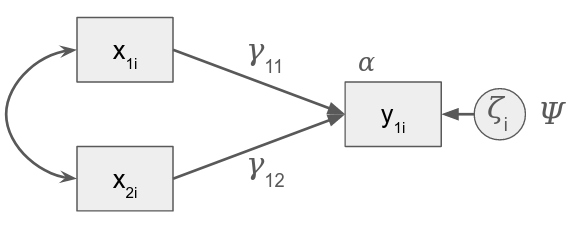
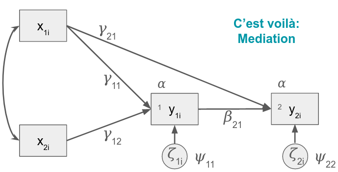

```{r setup, include=FALSE}
knitr::opts_chunk$set(echo = TRUE)
```

# Intro

## Loading Relevant Packages

```{r packages, message=FALSE}
packages =  c('lavaan','nlme','ggplot2','patchwork', 
              'kableExtra', 'psych', 'dplyr', 'tidyr',
              'semPlot')
if (length(setdiff(packages, rownames(installed.packages()))) > 0) {
  install.packages(setdiff(packages, rownames(installed.packages())), 
                   repos = "http://cran.us.r-project.org")
}
invisible(lapply(packages, library, character.only = TRUE))
```

## Read In Data

```{r}
ABCD = read.csv('abcd_sem.csv')
str(ABCD)
```

These data have been synthesized from other data and then addition simulations were performed to make the data behave. The original data labels were changed for use in the workshop. The relevant variables include:

`id`: unique identifier  
`female`: self-identified sex (binary: 0 = male, 1 = female)  
`advers`: did the individual experience early-childhood adversity (binary: 0 = no, 1 = yes)  
`VS`: measures of ventral striatum response during reward anticipation  
`EXT`: measures of parent-reported externalizing behavior  

## Descriptives

```{r descriptives, warning=FALSE}
describe(ABCD[,2:ncol(ABCD)], fast = TRUE) %>% 
  kbl() %>% 
  kable_styling(full_width = F)

#knitr::kable(describe(ABCD[,2:ncol(ABCD)], fast = TRUE))

# Density by Wave: VS Activation
ggplot(ABCD %>% 
         pivot_longer(cols=starts_with('VS'),
                      names_to='wave',
                      values_to='VS'),
       aes(x=VS, group=wave, fill=wave)) +
  geom_density(alpha=.4) +
  labs(title = 'VS Activation by Wave', 
       x='Beta', 
       y = 'Density', 
       fill='Wave:') +
  scale_fill_discrete(labels = c('1','2','3','4','5')) +
  theme(legend.position='bottom')


# VS Activation Change over Time: By ID
ggplot(ABCD %>% 
         pivot_longer(cols=starts_with('VS'),
                      names_to='wave',
                      values_to='VS') %>%
         filter(id %in% sample(unique(ABCD$id), 100)),
       aes(x=wave, y=VS, group=id)) +
  geom_line() + 
  labs(title = 'Changes in VS Activation', 
       x='Wave', 
       y = 'Beta') +
  scale_x_discrete(labels = c('1','2','3','4','5'))


# Density by Wave: Externalizing Behavior
ggplot(ABCD %>% 
         pivot_longer(cols=starts_with('EXT'),
                      names_to='wave',
                      values_to='EXT'),
       aes(x=EXT, group=wave, fill=wave)) +
  geom_density(alpha=.4) +
  labs(title = 'Externalizing Behavior by Wave', 
       x='Beta', 
       y = 'Density', 
       fill='Wave:') +
  scale_fill_discrete(labels = c('1','2','3','4','5')) +
  theme(legend.position='bottom')


# Externalizing Behavior Change over Time: By ID
ggplot(ABCD %>% 
         pivot_longer(cols=starts_with('EXT'),
                      names_to='wave',
                      values_to='EXT') %>%
         filter(id %in% sample(unique(ABCD$id), 100)),
       aes(x=wave, y=EXT, group=id)) +
  geom_line() + 
  labs(title = 'Changes in Externalizing', 
       x='Wave', 
       y = 'Externalizing Behavior') +
  scale_x_discrete(labels = c('1','2','3','4','5'))
```

# Some basics

## Residualized change v difference scores

To easily compute these scores, I'll make the data long and compute the lag (t-1) value for each variable.

```{r}
ABCD_l <- tidyr::pivot_longer(ABCD, names_to = 'key', values_to = 'value', tidyr::matches('^(VS|EXT)')) %>%
  tidyr::extract(col = key, into = c('var', 'wave'), regex = '(\\w+)\\.(\\d+)') %>%
  tidyr::pivot_wider(names_from = 'var', values_from = 'value') %>%
  dplyr::group_by(id) %>%
  dplyr::mutate(across(c(wave, EXT, VS), lag, .names = '{.col}_lag'))
```

Now I'll get the residuals from a simple `lm` model, and also compute the raw difference score.

```{r}
#residualized change
#get the residual for the regression for each wave on the one before it
ABCD_l_resid <- dplyr::group_by(filter(ABCD_l, !is.na(wave_lag)), wave, wave_lag) %>%
  mutate(VS_resid = resid(lm(VS ~ 1 + VS_lag, na.action = 'na.exclude')),
         EXT_resid = resid(lm(EXT ~ 1 + EXT_lag, na.action = 'na.exclude')))

#difference scores
#just take the difference between the measure at wave T and wave T-1
ABCD_l_resid_diff <- dplyr::group_by(ABCD_l_resid, wave, wave_lag, id) %>%
  mutate(VS_diff = VS - VS_lag,
         EXT_diff = EXT - EXT_lag)
```

What's the correlation of these?

```{r}
select(ungroup(ABCD_l_resid_diff), id, wave, matches('(VS|EXT)_(resid|diff)')) %>%
  pivot_longer(cols = c(-id, -wave)) %>%
  extract(name, c('var', 'stat'), '(\\w+)_(\\w+)') %>%
  pivot_wider(names_from = 'stat', values_from = 'value') %>%
  ggplot(aes(x = diff, y = resid)) + 
  # geom_point(size = .5, alpha = .05) + 
  geom_bin2d() + 
  geom_abline(intercept = 0, slope = 1) + 
  geom_line(stat = 'smooth', color = '#0099ff', size = 1) + 
  facet_grid(~var) + 
  scale_fill_gradient(low = '#660000', high = '#FFFF00') + 
  theme_minimal() + 
  coord_cartesian(x = c(-5, 5), y = c(-5, 5))
```

What does it seem like is going on here? 

Think about how the variance differs for each type of estimate.

## Equations, path diagrams, and ... SYNTAX

Equations are the real deal (as real as it gets at this level of abstraction). Path diagrams and syntax are both ways of conveying the equations.

Let's start with the first diagram we saw: 



The `lavaan` package in R has *[syntax](https://lavaan.ugent.be/tutorial/syntax1.html)* for all of the relationships here (plus more). If you recall, these are almost all just regressions. If you're already familiar with regression syntax in R, this will look familiar to you. One big difference from other common modeling packages is that the model is expressed as a string of text. We also need to learn the opperator for "covariance" to get the path between $x_{1i}$ and $x_{2i}$. We also need an operator to specify the residual variance. Yay: the variance and covariance operators are the same. The intercept also gets it's own notation (it's not part of the regression for reasons).

- Regression: `VAR1 ~ VAR2 [+ VAR3 ...]`
- (Co)variance: `VAR1 ~~ VAR2 [+ VAR3 ...]`
- Mean/Intercept: `VAR1 ~ 1`

_Note:_ Let's acknowledge that there is some weird stuff going on here. In this diagram y is regressed on the residual, but we only care about the residual's variance (the regression coefficient is actually set to 1). So you may see diagrams with arrows like this, or just with double headed arrows pointing to the same variable. To go down the rabbit hole a little further, you specify variances the same way whether they are variances of residuals (for variables that are on the DV side of a regression) *or* whether they are variances of a variable itself (if it's an IV). Moreover, sometimes they're not even written into the diagram! The diagram above assumes that both $x_{1i}$ and $x_{2i}$ have variances as well as covary with each other. 

_Also Note:_ Intercepts refer to means when they are part of a regression (conditional means), and means refer to means when they are unconditional. The syntax for both is the same

_Also Also Note:_ Variance/covariance structures are often very consistent across models so `lavaan` adds many in by default. Same with intercepts/means. For now, I'm going to write out the full model, noting where lavaan usually has defaults.

```
simple_sem_model <- '
y ~ x1 + x2

#lavaan covariance defaults
#notice we do not allow covariance between 
#residuals and the other variables.
x1 ~~ x1
x2 ~~ x1
x2 ~~ x2
y ~~ y

#lavaan intercept defaults
#Intercept
y ~ 1
#Means
x1 ~ 1
x2 ~ 1
'
```

We can count the number of parameters we think are implied by the model diagram and then count them in the syntax. 

Let's actually fit this model using variables from the sample data.

```{r}
names(ABCD)
simple_sem_model <- '
VS.2 ~ EXT.1 + EXT.2
EXT.2 ~~ EXT.1

#lavaan covariance defaults
#notice we do not allow covariance between 
#residuals and the other variables.
EXT.1 ~~ EXT.1
EXT.2 ~~ EXT.1
VS.2 ~~ VS.2

#lavaan mean/intercept defaults
#Intercept
VS.2 ~ 1
#Means
EXT.1 ~ 1
EXT.2 ~ 1
'

simple_sem_fit <- lavaan::sem(simple_sem_model, data = ABCD)
summary(simple_sem_fit)
```

Let's confirm what `lavaan` sets by default (see ?sem "Details" for more on the defaults).

```{r}
more_simple_sem_model <- '
VS.2 ~ EXT.1 + EXT.2
EXT.2 ~~ EXT.1
'

more_simple_sem_fit <- lavaan::sem(more_simple_sem_model, data = ABCD)
summary(more_simple_sem_fit)
```

Wait, what about the means? 

Often, we don't even care about the means. Who interprets the intercept of a regression? The `sem` function is set by default to not estimate _any_ means. But we can turn it on with `meanstructure = TRUE` in which case it will estimate all means and interecpts.

```{r}
more_simple_sem_fit <- lavaan::sem(more_simple_sem_model, data = ABCD, meanstructure = TRUE)
summary(more_simple_sem_fit)
```

This is the syntax we'll use to build up all the other models.

Oh, by the way, we can plot these too. More complex models don't work well but for simple ones we can:

```{r}
semPlot::semPaths(more_simple_sem_fit)
```

The triangle with the `1` inside indicates that a mean or intercept is estimated (this will be important for growth models where we care about the mean of the latent slope).

_*Crazy take-away point:*_ You can estimate the covariance structure separate from the mean structure!

## Syntax for a slightly more complicated model



How to think through writing out these models based on diagrams? I like to start with the regressions.

We have 2 regressions here for $y_{1i}$ and $y_{2i}$. Each has two arrows going into it. Let's find where they come from and write them out in lavaan syntax:

- `y1 ~ x1 + x2`
- `y2 ~ y1 + x1`

We now are left with one covariance:

- `x1 ~~ x2`

Using our variables from before (even though they might not make sense), we just add one regression equation:

```{r}
slightly_complicated_sem_model <- '
VS.2 ~ EXT.1 + EXT.2
VS.3 ~ VS.2 + EXT.1
EXT.2 ~~ EXT.1
'

#leaving the mean structure out
slightly_complicated_sem_fit <- sem(slightly_complicated_sem_model, data = ABCD)
summary(slightly_complicated_sem_fit)
semPlot::semPaths(slightly_complicated_sem_fit, layout = 'spring')
```

## Factors

This is where the magic starts to happen (though the above framework is awesome for doing regression too; very useful for mediation and other complex models).

Latent variables are nothing more than something invisible causing a bunch of things. In other words, it's a bunch of different y variables being regressed on something invisible.

```
some_factor_model <- '
y1 ~ ETA
y2 ~ ETA
y3 ~ ETA
y4 ~ ETA
'
```

```
some_factor_model <- '
EXT.1 ~ ETA
EXT.2 ~ ETA
EXT.3 ~ ETA
EXT.4 ~ ETA
'

some_factor_fit <- sem(some_factor_model, data = ABCD)
summary(some_factor_fit)
```

This doesn't run because ETA doesn't exist in the data. We need to use lavaan's syntax reserved for invisible variables:

- Factors: ` FACTOR =~ VAR1 [+ VAR2 ...]`

```{r}
some_factor_model <- '
EXT_FAC =~ EXT.1 + EXT.2 + EXT.3 + EXT.4
'

some_factor_fit <- sem(some_factor_model, data = ABCD)
summary(some_factor_fit)
```

Now EXT_FAC is a variable like any other, except that we're inferring it from the observed variables (i.e., the indicators). Notice that `EXT_FAC` gets its own variance. We can include it in regressions, and we can also get its mean.

```{r}
some_factor_model <- '
EXT_FAC =~ EXT.1 + EXT.2 + EXT.3 + EXT.4
VS.1 ~ EXT_FAC
'

some_factor_fit <- sem(some_factor_model, data = ABCD, meanstructure = TRUE)
summary(some_factor_fit)
```

Is it weird that the mean of `EXT_FAC` is 0? It's actually the default in this kind of model to _set_ it to 0. We'll see later when we run a latent growth model that it's allowed to be different from 0. However, this requires us to set other constraints.

### "True score"

Using latent variables means we get more precision

```{r}
ABCD_means <- ABCD %>% 
  group_by(id) %>%
  mutate(EXT_MEAN = mean(c(EXT.1, EXT.2, EXT.3, EXT.4)),
         VS_MEAN = mean(c(VS.1, VS.2, VS.3, VS.4)))
  
factor_model <- '
EXT_FAC =~ EXT.1 + EXT.2 + EXT.3 + EXT.4
VS_FAC =~ VS.1 + VS.2 + VS.3 +VS.4
VS_FAC ~~ EXT_FAC
'

factor_fit <- sem(factor_model, data = ABCD)
summary(factor_fit, stan = TRUE)
(scale_score_cor <- cor(ABCD_means[, c('EXT_MEAN', 'VS_MEAN')], use = 'pairwise.complete.obs'))
std <- standardizedSolution(factor_fit)
```

The correlation for the latent variable model is `r sprintf('%0.2f', std[std$rhs == 'VS_FAC' & std$lhs == 'EXT_FAC', 'est.std'])` versus `r sprintf('%0.2f', scale_score_cor[2,1])` for the zero-order correlation of the computed scale scores.

## Important `lavaan` & `semPlot` stuff

### Parameter specificaiton

We can "fix" parameters (e.g., factor loadings, covariances) by multiplying the variable by the value. To set a loading or covariance equal to 0, we can write `factor =~ 0*y1 + ...` or `EXT ~~ 0*VS`. _Anything that is not freely estimated in your model or by `lavaan` defaults is implicitly fixed to 0_. When reviewing your models you should make sure you're okay with both the paths that do exist as well as with the paths that are left unspeficied. Sometimes fixing a path to 0 is a stronger theoretical statement than letting it be estimated freely.

Additionally you can add in equality constraints by multiplying by some label (e.g., `y ~ some_label*x1`, where `some_label` is an arbitrary string) and re-using the same label on some other parameter: `y ~ some_label*x1 + some_label*x2`; here both regression coefficients would be estimated exactly equal. This is a great way to salvage degrees of freedom if those constraints can be justified. 

### Missing data

To specify how missing data are handled, we can use  `missing = 'listwise'` to choose to delete individuals with missing data. The better more common approach is to use `missing = 'ML'` to use full information maximum likelihood (FIML, also known just as ML; this is distinct from restricted maximum likelihood [ReML]).

**Never use listwise deletion when you can use ML.** ML estimation protects you from bias in more situations. See [this paper](https://www.sciencedirect.com/science/article/pii/S187892931730066X) for more information.


### Useful info in plots

We can add useful info to these plots:

```{r}
semPlot::semPaths(slightly_complicated_sem_fit, what = 'est', layout = 'spring')
semPlot::semPaths(slightly_complicated_sem_fit, what = 'std', layout = 'spring')
```

### Standardized coefficients

We can also get standardized paths from `lavaan`.

```{r}
summary(slightly_complicated_sem_fit, standardized = TRUE)
```

The Std.all column isi usually what you want to look at. Covariances in this column are equivalent to correlations (or partial correlations, if they are covariances between residuals). The Std.lv column shows values standardized only on the latent variables. We don't have any so they are equivalent to the Estimates.

# Autoregressive-type Models

## Autoregressive Cross-Lag Panel Models

Now we're starting to get into the longitudinalness of it all.

Remember the AR part of the model is just a series of regressions:

```
ARCL <- '
y4 ~ y3
y3 ~ y2
y2 ~ y1'
```

When we add in a second variable, we add in that variable's AR model,

```
ARCL <- '
#y
y4 ~ y3
y3 ~ y2
y2 ~ y1

#x
x4 ~ x3
x3 ~ x2
x2 ~ x1'
```

and we can also now add in the cross-lag part ($x_t = y_{t-1} +\dots$), 

```
ARCL <- '
#y
y4 ~ y3 + x3
y3 ~ y2 + x2
y2 ~ y1 + x1

#x
x4 ~ x3 + y3
x3 ~ x2 + y2
x2 ~ x1 + y1'
```

as well as the contemporaneous (residual) correlations.

```
ARCL <- '
#y
y4 ~ y3 + x3
y3 ~ y2 + x2
y2 ~ y1 + x1

#x
x4 ~ x3 + y3
x3 ~ x2 + y2
x2 ~ x1 + y1

#x ~~ y
x3 ~~ y3
x2 ~~ y2
x1 ~~ y1'
```

Let's look at this for the variables in the sample data:

```{r ARCL, warning=FALSE}
ARCL_model <- '
# Regressions for VS Activation
VS.2 ~ VS.1 + EXT.1
VS.3 ~ VS.2 + EXT.2
VS.4 ~ VS.3 + EXT.3
VS.5 ~ VS.4 + EXT.4

# Regressions for Externalizing Behavior
EXT.2 ~ EXT.1 + VS.1
EXT.3 ~ EXT.2 + VS.2
EXT.4 ~ EXT.3 + VS.3
EXT.5 ~ EXT.4 + VS.4

# Within-Time (Residual) Correlations
VS.1 ~~ EXT.1
VS.2 ~~ EXT.2
VS.3 ~~ EXT.3
VS.4 ~~ EXT.4
VS.5 ~~ EXT.5'

ARCL_fit <- sem(ARCL_model, data = ABCD, meanstructure = TRUE, missing = 'ML')
summary(ARCL_fit)

semPaths(ARCL_fit, layout='spring', intercepts=FALSE, what = 'std')
```

BUT REMEMBER NEVER USE THIS MODEL!

## RI-ARCL (RI-CLPM)

We can use the riclpmr pacakge to generate code for this model using a list of variable names grouped by construct.

See also this [blog post](https://johnflournoy.science/2017/10/20/riclpm-lavaan-demo/).


Notice a few things. First, we're estimating a mean for each variable. But we are also estimating a factor for each variable. The loadings are all set to 1. Why? In the factor model we saw before, the loadings were allowed to be free because we wanted the model to decide how much variance was due to a common factor versus error variance (this is the function of a measurement model). Here, we start with the assumption that the measurment model is well defined (in fact, we're assuming that the observations ($x_{1..3}$ and $y_{1..3}$) are all measured perfectly. What is this factor for then? It encodes the theoretical assumption that there is a stable trait for each variable $x$ and $y$ that causes the measurements. It's stable, so it causes them equally over time. 

In other words, the latent factors $\kappa$ and $\omega$ partial out stable, between-person (trait-like) differences from the observations. What's left behind are the residuals. We can conceptualize the residuals as the perturbations in the observations that are not explained by trait means. In other words, they are within-person changes unexplained by a stable mean score.

We can give "structure" to the residuals by turning them into factors ($p_{1..3}$ and $q_{1..3}$) which we can then use as variables in an ARCL model that describes the within-person change. Now you can see that each observation is determined by the between person factors ($\kappa$ and $\omega$), and the within-person factors ($p_{1..3}$ and $q_{1..3}$), with all of their loadings fixed to 1. 

We still have residual variance left over in $u_{2,3}$ and $v_{2,3}$.

This becomes a lot to specify, and the lavaan defaults don't always play nice with these models. To help estimate these things I (John) wrote a little package to help.

```{r RI-ARCL, warning=FALSE}
#https://johnflournoy.science/riclpmr/
#devtools::install_github('jflournoy/riclpmr')
library(riclpmr)

variable_groups <- list(
  EXT = c('EXT.1','EXT.2', 'EXT.3', 'EXT.4', 'EXT.5'),
  VS =  c('VS.1','VS.2', 'VS.3', 'VS.4', 'VS.5'))
RIARCL_model <- riclpmr::riclpm_text(var_groups = variable_groups, constrain_over_waves = FALSE)

#check the model code
cat(RIARCL_model)

RIARCL_fit <- riclpmr::lavriclpm(RIARCL_model, data = ABCD, missing = 'ML')
summary(RIARCL_fit)
```

_Note:_ This model centers the between-person differences at 0, so above the means for the variables `ri_EXT` and `ri_VS` are both 0. We can use a slightly different model, called the LCM-SR (see below) to create a mean-growth model that is better at describing mean change.

# Mean change using latent variables

## Intercept and slope latent curve model

Set aside the auto-regressive cross-lag model for a minute, but keep in mind the latent intercept we saw in the RI-CLPM. As is the case in a multilevel growth model, we can describe a series of observations as being a function of an intercept and a slope (with each person getting their own values for these, as in the "random slopes random intercepts" model). 

We start by specifying the intercept, very much like in the RI-CLPM:

```
Int =~ 1*y1 + 1*y2 + 1*y3 + 1*y4
```

Each person gets a value for Int that contributes equally to each of the observed `y`.

We continue by adding a slope:
```
int =~ 1*y1 + 1*y2 + 1*y3 + 1*y4
slp =~ 0*y1 + 1*y2 + 2*y3 + 3*y4
```

The slope latent variable increases its influence on the observed `y` more at each wave. The loadings (0,1,2,3) are essentially the `TIME` variable in a multilevel model. When the loading for slope is 0, the only contribution to the observed variables is the intercept. This is the timepoint for which the mean of the intercept factor is the expected mean of the data. In other words, time is "centered" at whatever timepoint you set the slope factor to 0.

Let's look at this using the data we have for externalizing:

```{r}
# Linear Slope: Externalizing Behavior
LCM_VSlin_model = 'int =~ 1*EXT.1 + 1*EXT.2 + 1*EXT.3 + 1*EXT.4 + 1*EXT.5
             slp =~ 0*EXT.1 + 1*EXT.2 + 2*EXT.3 + 3*EXT.4 + 4*EXT.5'

LCM_VSlin_fit = growth(LCM_VSlin_model, data=ABCD, missing = 'ML')
summary(LCM_VSlin_fit)
```

Notice we use the function `growth` now. This sets `lavaa` defaults to be appropriate for this (very common) model.

### Plotting

We can plot each individual's trajectory.

```{r}
pred_data <- as.data.frame(lavPredict(LCM_VSlin_fit, type = 'yhat')) %>%
  mutate(id = 1:n()) %>%
  pivot_longer(cols = 1:5) %>%
  extract(name, c('var', 'wave'), '(EXT)\\.(\\d+)')

ggplot(pred_data) + 
  geom_line(aes(x = wave, y = value, group = id), alpha = .1)
```

## Constrained latent growth models

The model above corresponds to a random intercept, random slope model. Let's play around with intercept-only models, and fixed intercepts and slopes.

Intercept only:

```{r}
# Intercept-Only Model: VS Activation
LCM_VSint = '
int =~ 1*VS.1 + 1*VS.2 + 1*VS.3 + 1*VS.4 + 1*VS.5'

LCM_VSint_fit = growth(LCM_VSint, data = ABCD, missing = 'ML')
summary(LCM_VSint_fit)
semPaths(LCM_VSint_fit, intercepts=TRUE)

pred_data <- as.data.frame(lavPredict(LCM_VSint_fit, type = 'yhat')) %>%
  mutate(id = 1:n()) %>%
  pivot_longer(cols = 1:5) %>%
  extract(name, c('var', 'wave'), '(VS)\\.(\\d+)')

ggplot(pred_data) + 
  geom_line(aes(x = wave, y = value, group = id), alpha = .1)
```

Slope variable, but slope is fixed:

```{r}

# Linear Slope: VS Activation (fixed effect of time)
LCM_VSlin_fixed = '
int =~ 1*VS.1 + 1*VS.2 + 1*VS.3 + 1*VS.4 + 1*VS.5
slp =~ 0*VS.1 + 1*VS.2 + 2*VS.3 + 3*VS.4 + 4*VS.5
slp ~~ 0*slp
slp ~~ 0*int #notice we also have to constrain this!'

LCM_VSlin_fixed_fit = growth(LCM_VSlin_fixed, data=ABCD, missing='ML')
summary(LCM_VSlin_fixed_fit)

pred_data <- as.data.frame(lavPredict(LCM_VSlin_fixed_fit, type = 'yhat')) %>%
  mutate(id = 1:n()) %>%
  pivot_longer(cols = 1:5) %>%
  extract(name, c('var', 'wave'), '(VS)\\.(\\d+)')

ggplot(pred_data) + 
  geom_line(aes(x = wave, y = value, group = id), alpha = .1)
```

Fixed intercept, slope random:

```{r}

# Linear Slope: VS Activation (fixed effect of intercept)
LCM_VSlin_fixedint = '
int =~ 1*VS.1 + 1*VS.2 + 1*VS.3 + 1*VS.4 + 1*VS.5
slp =~ 0*VS.1 + 1*VS.2 + 2*VS.3 + 3*VS.4 + 4*VS.5
int ~~ 0*int
int ~~ 0*slp'

LCM_VSlin_fixedint_fit = growth(LCM_VSlin_fixedint, data=ABCD, missing='ML')
summary(LCM_VSlin_fixedint_fit)

pred_data <- as.data.frame(lavPredict(LCM_VSlin_fixedint_fit, type = 'yhat')) %>%
  mutate(id = 1:n()) %>%
  pivot_longer(cols = 1:5) %>%
  extract(name, c('var', 'wave'), '(VS)\\.(\\d+)')

ggplot(pred_data) + 
  geom_line(aes(x = wave, y = value, group = id), alpha = .1)
```

Random intercept and slope:

```{r}

# Linear Slope: VS Activation (random effect of time)
LCM_VSlin = '
int =~ 1*VS.1 + 1*VS.2 + 1*VS.3 + 1*VS.4 + 1*VS.5
slp =~ 0*VS.1 + 1*VS.2 + 2*VS.3 + 3*VS.4 + 4*VS.5'

LCM_VSlin_fit = growth(LCM_VSlin, data=ABCD, missing='ML')
summary(LCM_VSlin_fit)
semPaths(LCM_VSlin_fit, intercepts=TRUE, edge.color='black', what = 'est')

pred_data <- as.data.frame(lavPredict(LCM_VSlin_fit, type = 'yhat')) %>%
  mutate(id = 1:n()) %>%
  pivot_longer(cols = 1:5) %>%
  extract(name, c('var', 'wave'), '(VS)\\.(\\d+)')

ggplot(pred_data) + 
  geom_line(aes(x = wave, y = value, group = id), alpha = .1)
```

Alternative time coding so that intercept is the mean level at the last wave:

```{r}
# Linear Slope: VS Activation (alternative time coding)
LCM_VSlin2 = '
int =~ 1*VS.1 + 1*VS.2 + 1*VS.3 + 1*VS.4 + 1*VS.5
slp =~ -4*VS.1 + -3*VS.2 + -2*VS.3 + -1*VS.4 + 0*VS.5'

LCM_VSlin2_fit = growth(LCM_VSlin2, data=ABCD, missing='ML')
summary(LCM_VSlin2_fit)

pred_data <- as.data.frame(lavPredict(LCM_VSlin2_fit, type = 'yhat')) %>%
  mutate(id = 1:n()) %>%
  pivot_longer(cols = 1:5) %>%
  extract(name, c('var', 'wave'), '(VS)\\.(\\d+)')

ggplot(pred_data) + 
  geom_line(aes(x = wave, y = value, group = id), alpha = .1)
```

# Advanced latent growth models

## Unconditional Quadratic Latent Growth Curve Model
```{r uLCM quadratic}
# Quadratic Effect: VS Activation
LCM.VSqud = 'int =~ 1*VS.1 + 1*VS.2 + 1*VS.3 + 1*VS.4 + 1*VS.5
             slp =~ 0*VS.1 + 1*VS.2 + 2*VS.3 + 3*VS.4 + 4*VS.5
             qud =~ 0*VS.1 + 1*VS.2 + 4*VS.3 + 9*VS.4 + 16*VS.5'

LCM.VSqud.fit = growth(LCM.VSqud, data=ABCD, missing='ML')
summary(LCM.VSqud.fit)
semPaths(LCM.VSqud.fit, intercepts=FALSE, edge.color='black')

# Quadratic Effect: Externalizing Behavior
LCM.EXTqud = 'int =~ 1*EXT.1 + 1*EXT.2 + 1*EXT.3 + 1*EXT.4 + 1*EXT.5
              slp =~ 0*EXT.1 + 1*EXT.2 + 2*EXT.3 + 3*EXT.4 + 4*EXT.5
              qud =~ 0*EXT.1 + 1*EXT.2 + 4*EXT.3 + 9*EXT.4 + 16*EXT.5'

LCM.EXTqud.fit = growth(LCM.EXTqud, data=ABCD, missing='ML')
summary(LCM.EXTqud.fit)

LCM.EXTqud2 = 'int =~ 1*EXT.1 + 1*EXT.2 + 1*EXT.3 + 1*EXT.4 + 1*EXT.5
               slp =~ 0*EXT.1 + 1*EXT.2 + 2*EXT.3 + 3*EXT.4 + 4*EXT.5
               qud =~ 0*EXT.1 + 1*EXT.2 + 4*EXT.3 + 9*EXT.4 + 16*EXT.5

               qud ~~ 0*qud
               qud ~~ 0*int + 0*slp'

LCM.EXTqud2.fit = growth(LCM.EXTqud2, data=ABCD, missing='ML')
summary(LCM.EXTqud2.fit)
```


## Unconditional Piecewise Latent Growth Curve Model
```{r uLCM piecewise}
# Piecewise Linear Effect: VS Activation
LCM.VSpw = 'int =~ 1*VS.1 + 1*VS.2 + 1*VS.3 + 1*VS.4 + 1*VS.5
            pw1 =~ 0*VS.1 + 1*VS.2 + 2*VS.3 + 3*VS.4 + 3*VS.5
            pw2 =~ 0*VS.1 + 0*VS.2 + 0*VS.3 + 1*VS.4 + 2*VS.5'

LCM.VSpw.fit = growth(LCM.VSpw, data=ABCD, missing='ML')
summary(LCM.VSpw.fit)
```


## Unconditional Latent Basis Growth Curve Model
```{r uLCM latent basis}
# Latent Basis Effect: VS Activation
LCM.VSfl = 'int =~ 1*VS.1 + 1*VS.2 + 1*VS.3 + 1*VS.4 + 1*VS.5
            fl =~ 0*VS.1 + 1*VS.2 + VS.3 + VS.4 + VS.5'

LCM.VSfl.fit = growth(LCM.VSfl, data=ABCD, missing='ML')
summary(LCM.VSfl.fit)
```


## Conditional Latent Growth Curve Model: TICs
```{r cLCM TIC}
# Conditional TIC Model
LCM.TIC = 'int =~ 1*VS.1 + 1*VS.2 + 1*VS.3 + 1*VS.4 + 1*VS.5
           slp =~ 0*VS.1 + 1*VS.2 + 2*VS.3 + 3*VS.4 + 4*VS.5

           int ~ female + advers
           slp ~ female + advers'

LCM.TIC.fit = growth(LCM.TIC, data=ABCD, missing='ML')
summary(LCM.TIC.fit)

semPaths(LCM.TIC.fit, intercepts=FALSE, edge.color='black')

# Conditional TIC Model with Explicit Exogenous Covariance
LCM.TIC = 'int =~ 1*VS.1 + 1*VS.2 + 1*VS.3 + 1*VS.4 + 1*VS.5
           slp =~ 0*VS.1 + 1*VS.2 + 2*VS.3 + 3*VS.4 + 4*VS.5

           int ~ female + advers
           slp ~ female + advers

           female ~~ advers'

LCM.TIC.fit = growth(LCM.TIC, data=ABCD, missing='ML')
summary(LCM.TIC.fit)
```


## Conditional Latent Growth Curve Model: TVCs
```{r cLCM TVC}
# Conditional TVC Model
LCM.TVC1 = 'int =~ 1*VS.1 + 1*VS.2 + 1*VS.3 + 1*VS.4 + 1*VS.5
            slp =~ 0*VS.1 + 1*VS.2 + 2*VS.3 + 3*VS.4 + 4*VS.5

            VS.1 ~ EXT.1
            VS.2 ~ EXT.2
            VS.3 ~ EXT.3
            VS.4 ~ EXT.4
            VS.5 ~ EXT.5

            int ~~ EXT.1 + EXT.2 + EXT.3 + EXT.4 + EXT.5
            slp ~~ EXT.1 + EXT.2 + EXT.3 + EXT.4 + EXT.5'

LCM.TVC1.fit = growth(LCM.TVC1, data=ABCD, missing='ML')
summary(LCM.TVC1.fit)
semPaths(LCM.TVC1.fit, intercepts=FALSE, edge.color='black')

# Conditional TVC Model with Equality Constraints
LCM.TVC2 = 'int =~ 1*VS.1 + 1*VS.2 + 1*VS.3 + 1*VS.4 + 1*VS.5
            slp =~ 0*VS.1 + 1*VS.2 + 2*VS.3 + 3*VS.4 + 4*VS.5

            VS.1 ~ a*EXT.1
            VS.2 ~ a*EXT.2
            VS.3 ~ a*EXT.3
            VS.4 ~ a*EXT.4
            VS.5 ~ a*EXT.5

            int ~~ EXT.1 + EXT.2 + EXT.3 + EXT.4 + EXT.5
            slp ~~ EXT.1 + EXT.2 + EXT.3 + EXT.4 + EXT.5'

LCM.TVC2.fit = growth(LCM.TVC2, data=ABCD, missing='ML')
summary(LCM.TVC2.fit)
semPaths(LCM.TVC2.fit, intercepts=FALSE, edge.color='black')
```


## Multivariate Latent Curve Model
```{r mLCM}
mLCM =     'VS.int =~ 1*VS.1 + 1*VS.2 + 1*VS.3 + 1*VS.4 + 1*VS.5
            VS.slp =~ 0*VS.1 + 1*VS.2 + 2*VS.3 + 3*VS.4 + 4*VS.5

            EXT.int =~ 1*EXT.1 + 1*EXT.2 + 1*EXT.3 + 1*EXT.4 + 1*EXT.5
            EXT.slp =~ 0*EXT.1 + 1*EXT.2 + 2*EXT.3 + 3*EXT.4 + 4*EXT.5

            VS.1 ~~ EXT.1
            VS.2 ~~ EXT.2
            VS.3 ~~ EXT.3
            VS.4 ~~ EXT.4
            VS.5 ~~ EXT.5
            
            VS.int ~~ VS.slp + EXT.int + EXT.slp
            VS.slp ~~ EXT.int + EXT.slp
            EXT.int ~~ EXT.slp'
mLCM.fit = growth(mLCM, data=ABCD, missing='ML')
summary(mLCM.fit)
semPaths(mLCM.fit, intercepts=FALSE, edge.color='black')
```


## Multivariate Latent Curve Model with Structured Residuals
```{r mLCM-SR}
mLCMSR =   '# Define the Latent Factors
            VS.int =~ 1*VS.1 + 1*VS.2 + 1*VS.3 + 1*VS.4 + 1*VS.5
            VS.slp =~ 0*VS.1 + 1*VS.2 + 2*VS.3 + 3*VS.4 + 4*VS.5

            EXT.int =~ 1*EXT.1 + 1*EXT.2 + 1*EXT.3 + 1*EXT.4 + 1*EXT.5
            EXT.slp =~ 0*EXT.1 + 1*EXT.2 + 2*EXT.3 + 3*EXT.4 + 4*EXT.5

            # Factor Covariances
            VS.int ~~ VS.slp + EXT.int + EXT.slp
            VS.slp ~~ EXT.int + EXT.slp
            EXT.int ~~ EXT.slp
            
            # Define Phantom Variables
            VS.1 ~~ 0*VS.1; srVS.1 =~ 1*VS.1; srVS.1 ~ 0; srVS.1 ~~ srVS.1
            VS.2 ~~ 0*VS.2; srVS.2 =~ 1*VS.2; srVS.2 ~ 0; srVS.2 ~~ srVS.2
            VS.3 ~~ 0*VS.3; srVS.3 =~ 1*VS.3; srVS.3 ~ 0; srVS.3 ~~ srVS.3
            VS.4 ~~ 0*VS.4; srVS.4 =~ 1*VS.4; srVS.4 ~ 0; srVS.4 ~~ srVS.4
            VS.5 ~~ 0*VS.5; srVS.5 =~ 1*VS.5; srVS.5 ~ 0; srVS.5 ~~ srVS.5
            
            EXT.1 ~~ 0*EXT.1; srEXT.1 =~ 1*EXT.1; srEXT.1 ~ 0; srEXT.1 ~~ srEXT.1
            EXT.2 ~~ 0*EXT.2; srEXT.2 =~ 1*EXT.2; srEXT.2 ~ 0; srEXT.2 ~~ srEXT.2
            EXT.3 ~~ 0*EXT.3; srEXT.3 =~ 1*EXT.3; srEXT.3 ~ 0; srEXT.3 ~~ srEXT.3
            EXT.4 ~~ 0*EXT.4; srEXT.4 =~ 1*EXT.4; srEXT.4 ~ 0; srEXT.4 ~~ srEXT.4
            EXT.5 ~~ 0*EXT.5; srEXT.5 =~ 1*EXT.5; srEXT.5 ~ 0; srEXT.5 ~~ srEXT.5
            
            # Structured Residuals Regressions + Covariances
            srVS.2 ~ a*srVS.1 + b*srEXT.1
            srVS.3 ~ a*srVS.2 + b*srEXT.2
            srVS.4 ~ a*srVS.3 + b*srEXT.3
            srVS.5 ~ a*srVS.4 + b*srEXT.4
            
            srEXT.2 ~ c*srEXT.1 + d*srVS.1
            srEXT.3 ~ c*srEXT.2 + d*srVS.2
            srEXT.4 ~ c*srEXT.3 + d*srVS.3
            srEXT.5 ~ c*srEXT.4 + d*srVS.4
            
            srVS.1 ~~ srEXT.1
            srVS.2 ~~ srEXT.2
            srVS.3 ~~ srEXT.3
            srVS.4 ~~ srEXT.4
            srVS.5 ~~ srEXT.5
            
            # Uncouple 1st SRs from Growth Factors
            VS.int ~~ 0*srVS.1 + 0*srEXT.1
            VS.slp ~~ 0*srVS.1 + 0*srEXT.1
            EXT.int ~~ 0*srVS.1 + 0*srEXT.1
            EXT.slp ~~ 0*srVS.1 + 0*srEXT.1
'
mLCMSR.fit = growth(mLCMSR, data=ABCD, missing='ML')
summary(mLCMSR.fit)

semPaths(mLCMSR.fit, layout='spring', intercepts = F, residuals = F)
```


## Two-Timepoint Latent Change Score
```{r 2TP LCS}
# FIML 2TP LCS Model
LCS1 = '# Set Regression Path to 1
        VS.2 ~ 1*VS.1
        
        # Define Change Latent Variable
        dVS.21 =~ 1*VS.2
        dVS.21 ~ 1
        
        # Estimate Intercept and Variance of V.1
        VS.1 ~ 1
        VS.1 ~~ VS.1
        
        # Constraint Intercept and Variance of V.2 to 0
        VS.2 ~ 0
        VS.2 ~~ 0*VS.2
'
LCS1.fit = sem(LCS1, data=ABCD, missing='ML')
summary(LCS1.fit)

# Complete Case 2TP LCS Model
LCS1.fit2 = sem(LCS1, data=ABCD, missing='listwise')
summary(LCS1.fit2)

# Paired Samples T-Test
t.test(ABCD$VS.1, ABCD$VS.2, paired=TRUE)
describe(ABCD[,c('VS.1','VS.2')])
6.248 + .188

# Proportional Change LCS
LCS2 = '# Set Regression Path to 1
        VS.2 ~ 1*VS.1
        
        # Define Change Latent Variable
        dVS.21 =~ 1*VS.2
        dVS.21 ~ 1
        
        # Regress Change on Initial Status
        dVS.21 ~ VS.1
        
        # Estimate Intercept and Variance of V.1
        VS.1 ~ 1
        VS.1 ~~ VS.1
        
        # Constraint Intercept and Variance of V.2 to 0
        VS.2 ~ 0
        VS.2 ~~ 0*VS.2
'
LCS2.fit = sem(LCS2, data=ABCD, missing='ML')
summary(LCS2.fit)
```


## Latent Change Score Trajectory Model

```{r LCS Trajectories}
# LCS Trajectory Model
LCSt = '# Define Phantom Variables
        pVS.1 =~ 1*VS.1; VS.1 ~ 0; VS.1 ~~ VS.1; pVS.1 ~~ 0*pVS.1
        pVS.2 =~ 1*VS.2; VS.2 ~ 0; VS.2 ~~ VS.2; pVS.2 ~~ 0*pVS.2
        pVS.3 =~ 1*VS.3; VS.3 ~ 0; VS.3 ~~ VS.3; pVS.3 ~~ 0*pVS.3
        pVS.4 =~ 1*VS.4; VS.4 ~ 0; VS.4 ~~ VS.4; pVS.4 ~~ 0*pVS.4
        pVS.5 =~ 1*VS.5; VS.5 ~ 0; VS.5 ~~ VS.5; pVS.5 ~~ 0*pVS.5
        
        # Regressions Between Adjacent Observations
        pVS.2 ~ 1*pVS.1
        pVS.3 ~ 1*pVS.2
        pVS.4 ~ 1*pVS.3
        pVS.5 ~ 1*pVS.4
        
        # Define Change Latent Variables
        dVS.21 =~ 1*pVS.2; dVS.21 ~~ 0*dVS.21
        dVS.32 =~ 1*pVS.3; dVS.32 ~~ 0*dVS.32
        dVS.43 =~ 1*pVS.4; dVS.43 ~~ 0*dVS.43
        dVS.54 =~ 1*pVS.5; dVS.54 ~~ 0*dVS.54
        
        # Define Intercept and Slope
        int =~ 1*pVS.1
        slp =~ 1*dVS.21 + 1*dVS.32 + 1*dVS.43 + 1*dVS.54
        
        int ~ 1
        slp ~ 1
        int ~~ int + slp
        slp ~~ slp
'
LCSt.fit = sem(LCSt, data=ABCD, missing='ML')
summary(LCSt.fit)

# Identical LCM Model
summary(LCM_VSlin_fit)

# Proportional Change LCS Trajectory Model
LCSpt = '# Define Phantom Variables
        pVS.1 =~ 1*VS.1; VS.1 ~ 0; VS.1 ~~ VS.1; pVS.1 ~~ 0*pVS.1
        pVS.2 =~ 1*VS.2; VS.2 ~ 0; VS.2 ~~ VS.2; pVS.2 ~~ 0*pVS.2
        pVS.3 =~ 1*VS.3; VS.3 ~ 0; VS.3 ~~ VS.3; pVS.3 ~~ 0*pVS.3
        pVS.4 =~ 1*VS.4; VS.4 ~ 0; VS.4 ~~ VS.4; pVS.4 ~~ 0*pVS.4
        pVS.5 =~ 1*VS.5; VS.5 ~ 0; VS.5 ~~ VS.5; pVS.5 ~~ 0*pVS.5
        
        # Regressions Between Adjacent Observations
        pVS.2 ~ 1*pVS.1
        pVS.3 ~ 1*pVS.2
        pVS.4 ~ 1*pVS.3
        pVS.5 ~ 1*pVS.4
        
        # Define Change Latent Variables
        dVS.21 =~ 1*pVS.2; dVS.21 ~~ 0*dVS.21
        dVS.32 =~ 1*pVS.3; dVS.32 ~~ 0*dVS.32
        dVS.43 =~ 1*pVS.4; dVS.43 ~~ 0*dVS.43
        dVS.54 =~ 1*pVS.5; dVS.54 ~~ 0*dVS.54
        
        # Define Proportional Regressions
        dVS.21 ~ beta*pVS.1
        dVS.32 ~ beta*pVS.2
        dVS.43 ~ beta*pVS.3
        dVS.54 ~ beta*pVS.4
        
        # Define Intercept and Slope
        int =~ 1*pVS.1
        slp =~ 1*dVS.21 + 1*dVS.32 + 1*dVS.43 + 1*dVS.54
        
        int ~ 1
        slp ~ 1
        int ~~ int + slp
        slp ~~ slp
'
LCSpt.fit = sem(LCSpt, data=ABCD, missing='ML')
summary(LCSpt.fit)
```


## Bivariate Latent Change Score Model
```{r Bivar LCS}
# Bivariate Within-Construct Proportional LCS Trajectory Model
bLCSt = '# Define Phantom Variables
         pVS.1 =~ 1*VS.1; VS.1 ~ 0; VS.1 ~~ VS.1; pVS.1 ~~ 0*pVS.1
         pVS.2 =~ 1*VS.2; VS.2 ~ 0; VS.2 ~~ VS.2; pVS.2 ~~ 0*pVS.2
         pVS.3 =~ 1*VS.3; VS.3 ~ 0; VS.3 ~~ VS.3; pVS.3 ~~ 0*pVS.3
         pVS.4 =~ 1*VS.4; VS.4 ~ 0; VS.4 ~~ VS.4; pVS.4 ~~ 0*pVS.4
         pVS.5 =~ 1*VS.5; VS.5 ~ 0; VS.5 ~~ VS.5; pVS.5 ~~ 0*pVS.5
         
         pEXT.1 =~ 1*EXT.1; EXT.1 ~ 0; EXT.1 ~~ EXT.1; pEXT.1 ~~ 0*pEXT.1
         pEXT.2 =~ 1*EXT.2; EXT.2 ~ 0; EXT.2 ~~ EXT.2; pEXT.2 ~~ 0*pEXT.2
         pEXT.3 =~ 1*EXT.3; EXT.3 ~ 0; EXT.3 ~~ EXT.3; pEXT.3 ~~ 0*pEXT.3
         pEXT.4 =~ 1*EXT.4; EXT.4 ~ 0; EXT.4 ~~ EXT.4; pEXT.4 ~~ 0*pEXT.4
         pEXT.5 =~ 1*EXT.5; EXT.5 ~ 0; EXT.5 ~~ EXT.5; pEXT.5 ~~ 0*pEXT.5
         
         # Residual Cross-Construct Covariances
         VS.1 ~~ EXT.1
         VS.2 ~~ EXT.2
         VS.3 ~~ EXT.3
         VS.4 ~~ EXT.4
         VS.5 ~~ EXT.5
        
         # Regressions Between Adjacent Observations
         pVS.2 ~ 1*pVS.1
         pVS.3 ~ 1*pVS.2
         pVS.4 ~ 1*pVS.3
         pVS.5 ~ 1*pVS.4
         
         pEXT.2 ~ 1*pEXT.1
         pEXT.3 ~ 1*pEXT.2
         pEXT.4 ~ 1*pEXT.3
         pEXT.5 ~ 1*pEXT.4
        
         # Define Change Latent Variables
         dVS.21 =~ 1*pVS.2; dVS.21 ~~ 0*dVS.21
         dVS.32 =~ 1*pVS.3; dVS.32 ~~ 0*dVS.32
         dVS.43 =~ 1*pVS.4; dVS.43 ~~ 0*dVS.43
         dVS.54 =~ 1*pVS.5; dVS.54 ~~ 0*dVS.54
         
         dEXT.21 =~ 1*pEXT.2; dEXT.21 ~~ 0*dEXT.21
         dEXT.32 =~ 1*pEXT.3; dEXT.32 ~~ 0*dEXT.32
         dEXT.43 =~ 1*pEXT.4; dEXT.43 ~~ 0*dEXT.43
         dEXT.54 =~ 1*pEXT.5; dEXT.54 ~~ 0*dEXT.54
         
         # Define Within-Construct Proportional Regressions
         dVS.21 ~ beta.V*pVS.1
         dVS.32 ~ beta.V*pVS.2
         dVS.43 ~ beta.V*pVS.3
         dVS.54 ~ beta.V*pVS.4
         
         dEXT.21 ~ beta.E*pEXT.1
         dEXT.32 ~ beta.E*pEXT.2
         dEXT.43 ~ beta.E*pEXT.3
         dEXT.54 ~ beta.E*pEXT.4
        
         # Define Intercept and Slope
         int.V =~ 1*pVS.1
         slp.V =~ 1*dVS.21 + 1*dVS.32 + 1*dVS.43 + 1*dVS.54
        
         int.V ~ 1
         slp.V ~ 1
         int.V ~~ int.V + slp.V + int.E + slp.E
         slp.V ~~ slp.V + int.E + slp.E
         
         int.E =~ 1*pEXT.1
         slp.E =~ 1*dEXT.21 + 1*dEXT.32 + 1*dEXT.43 + 1*dEXT.54
        
         int.E ~ 1
         slp.E ~ 1
         int.E ~~ int.E + slp.E
         slp.E ~~ slp.E
'
bLCSt.fit = sem(bLCSt, data=ABCD, missing='ML')
summary(bLCSt.fit)

# Bivariate Dual Change LCS Trajectory Model
bLCSpt = '# Define Phantom Variables
          pVS.1 =~ 1*VS.1; VS.1 ~ 0; VS.1 ~~ VS.1; pVS.1 ~~ 0*pVS.1
          pVS.2 =~ 1*VS.2; VS.2 ~ 0; VS.2 ~~ VS.2; pVS.2 ~~ 0*pVS.2
          pVS.3 =~ 1*VS.3; VS.3 ~ 0; VS.3 ~~ VS.3; pVS.3 ~~ 0*pVS.3
          pVS.4 =~ 1*VS.4; VS.4 ~ 0; VS.4 ~~ VS.4; pVS.4 ~~ 0*pVS.4
          pVS.5 =~ 1*VS.5; VS.5 ~ 0; VS.5 ~~ VS.5; pVS.5 ~~ 0*pVS.5
         
          pEXT.1 =~ 1*EXT.1; EXT.1 ~ 0; EXT.1 ~~ EXT.1; pEXT.1 ~~ 0*pEXT.1
          pEXT.2 =~ 1*EXT.2; EXT.2 ~ 0; EXT.2 ~~ EXT.2; pEXT.2 ~~ 0*pEXT.2
          pEXT.3 =~ 1*EXT.3; EXT.3 ~ 0; EXT.3 ~~ EXT.3; pEXT.3 ~~ 0*pEXT.3
          pEXT.4 =~ 1*EXT.4; EXT.4 ~ 0; EXT.4 ~~ EXT.4; pEXT.4 ~~ 0*pEXT.4
          pEXT.5 =~ 1*EXT.5; EXT.5 ~ 0; EXT.5 ~~ EXT.5; pEXT.5 ~~ 0*pEXT.5
          
          # Residual Cross-Construct Covariances
          VS.1 ~~ EXT.1
          VS.2 ~~ EXT.2
          VS.3 ~~ EXT.3
          VS.4 ~~ EXT.4
          VS.5 ~~ EXT.5
         
          # Regressions Between Adjacent Observations
          pVS.2 ~ 1*pVS.1
          pVS.3 ~ 1*pVS.2
          pVS.4 ~ 1*pVS.3
          pVS.5 ~ 1*pVS.4
         
          pEXT.2 ~ 1*pEXT.1
          pEXT.3 ~ 1*pEXT.2
          pEXT.4 ~ 1*pEXT.3
          pEXT.5 ~ 1*pEXT.4
        
          # Define Change Latent Variables
          dVS.21 =~ 1*pVS.2; dVS.21 ~~ 0*dVS.21
          dVS.32 =~ 1*pVS.3; dVS.32 ~~ 0*dVS.32
          dVS.43 =~ 1*pVS.4; dVS.43 ~~ 0*dVS.43
          dVS.54 =~ 1*pVS.5; dVS.54 ~~ 0*dVS.54
         
          dEXT.21 =~ 1*pEXT.2; dEXT.21 ~~ 0*dEXT.21
          dEXT.32 =~ 1*pEXT.3; dEXT.32 ~~ 0*dEXT.32
          dEXT.43 =~ 1*pEXT.4; dEXT.43 ~~ 0*dEXT.43
          dEXT.54 =~ 1*pEXT.5; dEXT.54 ~~ 0*dEXT.54
         
          # Define Within- and Between Construct Proportional Regressions
          dVS.21 ~ beta.V*pVS.1 + beta.VE*pEXT.1
          dVS.32 ~ beta.V*pVS.2 + beta.VE*pEXT.2
          dVS.43 ~ beta.V*pVS.3 + beta.VE*pEXT.3
          dVS.54 ~ beta.V*pVS.4 + beta.VE*pEXT.4
          
          dEXT.21 ~ beta.E*pEXT.1 + beta.EV*pVS.1
          dEXT.32 ~ beta.E*pEXT.2 + beta.EV*pVS.2
          dEXT.43 ~ beta.E*pEXT.3 + beta.EV*pVS.3
          dEXT.54 ~ beta.E*pEXT.4 + beta.EV*pVS.4
        
          # Define Intercept and Slope
          int.V =~ 1*pVS.1
          slp.V =~ 1*dVS.21 + 1*dVS.32 + 1*dVS.43 + 1*dVS.54
        
          int.V ~ 1
          slp.V ~ 1
          int.V ~~ int.V + slp.V + int.E + slp.E
          slp.V ~~ slp.V + int.E + slp.E
         
          int.E =~ 1*pEXT.1
          slp.E =~ 1*dEXT.21 + 1*dEXT.32 + 1*dEXT.43 + 1*dEXT.54
        
          int.E ~ 1
          slp.E ~ 1
          int.E ~~ int.E + slp.E
          slp.E ~~ slp.E
'
bLCSpt.fit = sem(bLCSpt, data=ABCD, missing='ML')
summary(bLCSpt.fit)
```