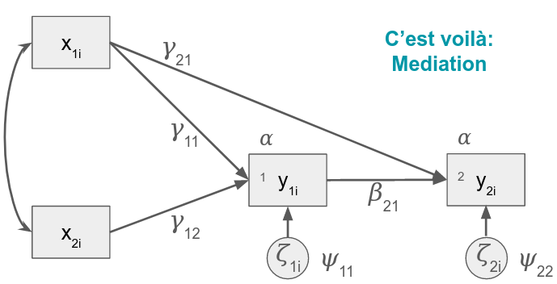

```{r setup, include=FALSE}
knitr::opts_chunk$set(echo = TRUE)
```

## Loading Relevant Packages
```{r packages, message=FALSE}
packages =  c('lavaan','nlme','ggplot2','patchwork', 
              'kableExtra', 'psych', 'dplyr', 'tidyr',
              'semPlot')
if (length(setdiff(packages, rownames(installed.packages()))) > 0) {
  install.packages(setdiff(packages, rownames(installed.packages())), 
                   repos = "http://cran.us.r-project.org")
}
invisible(lapply(packages, library, character.only = TRUE))
```

## Read In Data
```{r}
ABCD = read.csv('abcd_sem.csv')
str(ABCD)
```

These data have been synthesized from other data and then addition simulations were performed to make the data behave. The original data labels were changed for use in the workshop. The relevant variables include:

`id`: unique identifier  
`female`: self-identified sex (binary: 0 = male, 1 = female)  
`advers`: did the individual experience early-childhood adversity (binary: 0 = no, 1 = yes)  
`VS`: measures of ventral striatum response during reward anticipation  
`EXT`: measures of parent-reported externalizing behavior  

## Descriptives
```{r descriptives, warning=FALSE}
describe(ABCD[,2:ncol(ABCD)], fast = TRUE) %>% 
  kbl() %>% 
  kable_styling(full_width = F)

#knitr::kable(describe(ABCD[,2:ncol(ABCD)], fast = TRUE))

# Density by Wave: VS Activation
ggplot(ABCD %>% 
         pivot_longer(cols=starts_with('VS'),
                      names_to='wave',
                      values_to='VS'),
       aes(x=VS, group=wave, fill=wave)) +
  geom_density(alpha=.4) +
  labs(title = 'VS Activation by Wave', 
       x='Beta', 
       y = 'Density', 
       fill='Wave:') +
  scale_fill_discrete(labels = c('1','2','3','4','5')) +
  theme(legend.position='bottom')


# VS Activation Change over Time: By ID
ggplot(ABCD %>% 
         pivot_longer(cols=starts_with('VS'),
                      names_to='wave',
                      values_to='VS') %>%
         filter(id %in% sample(unique(ABCD$id), 100)),
       aes(x=wave, y=VS, group=id)) +
  geom_line() + 
  labs(title = 'Changes in VS Activation', 
       x='Wave', 
       y = 'Beta') +
  scale_x_discrete(labels = c('1','2','3','4','5'))


# Density by Wave: Externalizing Behavior
ggplot(ABCD %>% 
         pivot_longer(cols=starts_with('EXT'),
                      names_to='wave',
                      values_to='EXT'),
       aes(x=EXT, group=wave, fill=wave)) +
  geom_density(alpha=.4) +
  labs(title = 'Externalizing Behavior by Wave', 
       x='Beta', 
       y = 'Density', 
       fill='Wave:') +
  scale_fill_discrete(labels = c('1','2','3','4','5')) +
  theme(legend.position='bottom')


# Externalizing Behavior Change over Time: By ID
ggplot(ABCD %>% 
         pivot_longer(cols=starts_with('EXT'),
                      names_to='wave',
                      values_to='EXT') %>%
         filter(id %in% sample(unique(ABCD$id), 100)),
       aes(x=wave, y=EXT, group=id)) +
  geom_line() + 
  labs(title = 'Changes in Externalizing', 
       x='Wave', 
       y = 'Externalizing Behavior') +
  scale_x_discrete(labels = c('1','2','3','4','5'))
```

# Residualized change v difference scores

To easily compute these scores, I'll make the data long and compute the lag (t-1) value for each variable.

```{r}
ABCD_l <- tidyr::pivot_longer(ABCD, names_to = 'key', values_to = 'value', tidyr::matches('^(VS|EXT)')) %>%
  tidyr::extract(col = key, into = c('var', 'wave'), regex = '(\\w+)\\.(\\d+)') %>%
  tidyr::pivot_wider(names_from = 'var', values_from = 'value') %>%
  dplyr::group_by(id) %>%
  dplyr::mutate(across(c(wave, EXT, VS), lag, .names = '{.col}_lag'))
```

Now I'll get the residuals from a simple `lm` model, and also compute the raw difference score.

```{r}
#residualized change
#get the residual for the regression for each wave on the one before it
ABCD_l_resid <- dplyr::group_by(filter(ABCD_l, !is.na(wave_lag)), wave, wave_lag) %>%
  mutate(VS_resid = resid(lm(VS ~ 1 + VS_lag, na.action = 'na.exclude')),
         EXT_resid = resid(lm(EXT ~ 1 + EXT_lag, na.action = 'na.exclude')))

#difference scores
#just take the difference between the measure at wave T and wave T-1
ABCD_l_resid_diff <- dplyr::group_by(ABCD_l_resid, wave, wave_lag, id) %>%
  mutate(VS_diff = VS - VS_lag,
         EXT_diff = EXT - EXT_lag)
```

What's the correlation of these?

```{r}
select(ungroup(ABCD_l_resid_diff), id, wave, matches('(VS|EXT)_(resid|diff)')) %>%
  pivot_longer(cols = c(-id, -wave)) %>%
  extract(name, c('var', 'stat'), '(\\w+)_(\\w+)') %>%
  pivot_wider(names_from = 'stat', values_from = 'value') %>%
  ggplot(aes(x = diff, y = resid)) + 
  # geom_point(size = .5, alpha = .05) + 
  geom_bin2d() + 
  geom_abline(intercept = 0, slope = 1) + 
  geom_line(stat = 'smooth', color = '#0099ff', size = 1) + 
  facet_grid(~var) + 
  scale_fill_gradient(low = '#660000', high = '#FFFF00') + 
  theme_minimal() + 
  coord_cartesian(x = c(-5, 5), y = c(-5, 5))
```

What does it seem like is going on here? 

Think about how the variance differs for each type of estimate.

# Equations, path diagrams, and ... SYNTAX

Equations are the real deal (as real as it gets at this level of abstraction). Path diagrams and syntax are both ways of conveying the equations.

Let's start with the first diagram we saw: 


The `lavaan` package in R has *[syntax](https://lavaan.ugent.be/tutorial/syntax1.html)* for all of the relationships here (plus more). If you recall, these are almost all just regressions. If you're already familiar with regression syntax in R, this will look familiar to you. One big difference from other common modeling packages is that the model is expressed as a string of text. We also need to learn the opperator for "covariance" to get the path between $x_{1i}$ and $x_{2i}$. We also need an operator to specify the residual variance. Yay: the variance and covariance operators are the same. The intercept also gets it's own notation (it's not part of the regression for reasons).

- Regression: `VAR1 ~ VAR2 [+ VAR3 ...]`
- (Co)variance: `VAR1 ~~ VAR2 [+ VAR3 ...]`
- Mean/Intercept: `VAR1 ~ 1`

_Note:_ Let's acknowledge that there is some weird stuff going on here. In this diagram y is regressed on the residual, but we only care about the residual's variance (the regression coefficient is actually set to 1). So you may see diagrams with arrows like this, or just with double headed arrows pointing to the same variable. To go down the rabbit hole a little further, you specify variances the same way whether they are variances of residuals (for variables that are on the DV side of a regression) *or* whether they are variances of a variable itself (if it's an IV). Moreover, sometimes they're not even written into the diagram! The diagram above assumes that both $x_{1i}$ and $x_{2i}$ have variances as well as covary with each other. 

_Also Note:_ Intercepts refer to means when they are part of a regression (conditional means), and means refer to means when they are unconditional. The syntax for both is the same

_Also Also Note:_ Variance/covariance structures are often very consistent across models so `lavaan` adds many in by default. Same with intercepts/means. For now, I'm going to write out the full model, noting where lavaan usually has defaults.

```
simple_sem_model <- '
y ~ x1 + x2

#lavaan covariance defaults
#notice we do not allow covariance between 
#residuals and the other variables.
x1 ~~ x1
x2 ~~ x1
x2 ~~ x2
y ~~ y

#lavaan intercept defaults
#Intercept
y ~ 1
#Means
x1 ~ 1
x2 ~ 1
'
```

We can count the number of parameters we think are implied by the model diagram and then count them in the syntax. 

Let's actually fit this model using variables from the sample data.

```{r}
names(ABCD)
simple_sem_model <- '
VS.2 ~ EXT.1 + EXT.2
EXT.2 ~~ EXT.1

#lavaan covariance defaults
#notice we do not allow covariance between 
#residuals and the other variables.
EXT.1 ~~ EXT.1
EXT.2 ~~ EXT.1
VS.2 ~~ VS.2

#lavaan mean/intercept defaults
#Intercept
VS.2 ~ 1
#Means
EXT.1 ~ 1
EXT.2 ~ 1
'

simple_sem_fit <- lavaan::sem(simple_sem_model, data = ABCD)
summary(simple_sem_fit)
```

Let's confirm what `lavaan` sets by default (see ?sem "Details" for more on the defaults).

```{r}
more_simple_sem_model <- '
VS.2 ~ EXT.1 + EXT.2
EXT.2 ~~ EXT.1
'

more_simple_sem_fit <- lavaan::sem(more_simple_sem_model, data = ABCD)
summary(more_simple_sem_fit)
```

Wait, what about the means? 

Often, we don't even care about the means. Who interprets the intercept of a regression? The `sem` function is set by default to not estimate _any_ means. But we can turn it on with `meanstructure = TRUE` in which case it will estimate all means and interecpts.

```{r}
more_simple_sem_fit <- lavaan::sem(more_simple_sem_model, data = ABCD, meanstructure = TRUE)
summary(more_simple_sem_fit)
```

This is the syntax we'll use to build up all the other models.

Oh, by the way, we can plot these too. More complex models don't work well but for simple ones we can:

```{r}
semPlot::semPaths(more_simple_sem_fit)
```

The triangle with the `1` inside indicates that a mean or intercept is estimated (this will be important for growth models where we care about the mean of the latent slope).

_*Crazy take-away point:*_ You can estimate the covariance structure separate from the mean structure!

# Syntax for a slightly more complicated model



How to think through writing out these models based on diagrams? I like to start with the regressions.

We have 2 regressions here for $y_{1i}$ and $y_{2i}$. Each has two arrows going into it. Let's find where they come from and write them out in lavaan syntax:

- `y1 ~ x1 + x2`
- `y2 ~ y1 + x1`

We now are left with one covariance:

- `x1 ~~ x2`

Using our variables from before (even though they might not make sense), we just add one regression equation:

```{r}
slightly_complicated_sem_model <- '
VS.2 ~ EXT.1 + EXT.2
VS.3 ~ VS.2 + EXT.1
EXT.2 ~~ EXT.1
'

#leaving the mean structure out
slightly_complicated_sem_fit <- sem(slightly_complicated_sem_model, data = ABCD)
summary(slightly_complicated_sem_fit)
semPlot::semPaths(slightly_complicated_sem_fit, layout = 'spring')
```

# Misc. `lavaan` & `semPlot` stuff

We can add useful info to these plots:

```{r}
semPlot::semPaths(slightly_complicated_sem_fit, what = 'est', layout = 'spring')
semPlot::semPaths(slightly_complicated_sem_fit, what = 'std', layout = 'spring')
```

We can also get standardized paths from `lavaan`.

```{r}
summary(slightly_complicated_sem_fit, standardized = TRUE)
```

The Std.all column isi usually what you want to look at. Covariances in this column are equivalent to correlations (or partial correlations, if they are covariances between residuals). The Std.lv column shows values standardized only on the latent variables. We don't have any so they are equivalent to the Estimates.

# Factors

This is where the magic starts to happen (though the above framework is awesome for doing regression too; very useful for mediation and other complex models).

Latent variables are nothing more than something invisible causing a bunch of things. In other words, it's a bunch of different y variables being regressed on something invisible.

```
some_factor_model <- '
y1 ~ ETA
y2 ~ ETA
y3 ~ ETA
y4 ~ ETA
'
```

```
some_factor_model <- '
EXT.1 ~ ETA
EXT.2 ~ ETA
EXT.3 ~ ETA
EXT.4 ~ ETA
'

some_factor_fit <- sem(some_factor_model, data = ABCD)
summary(some_factor_fit)
```

This doesn't run because ETA doesn't exist in the data. We need to use lavaan's syntax reserved for invisible variables:

- Factors: ` FACTOR =~ VAR1 [+ VAR2 ...]`

```{r}
some_factor_model <- '
EXT_FAC =~ EXT.1 + EXT.2 + EXT.3 + EXT.4
'

some_factor_fit <- sem(some_factor_model, data = ABCD)
summary(some_factor_fit)
```

Now EXT_FAC is a variable like any other, except that we're inferring it from the observed variables (i.e., the indicators). Notice that `EXT_FAC` gets its own variance. We can include it in regressions, and we can also get its mean.

```{r}
some_factor_model <- '
EXT_FAC =~ EXT.1 + EXT.2 + EXT.3 + EXT.4
VS.1 ~ EXT_FAC
'

some_factor_fit <- sem(some_factor_model, data = ABCD, meanstructure = TRUE)
summary(some_factor_fit)
```

Is it weird that the mean of `EXT_FAC` is 0? It's actually the default in this kind of model to _set_ it to 0. We'll see later when we run a latent growth model that it's allowed to be different from 0. However, this requires us to set other constraints.

## "True score"

Using latent variables means we get more precision

```{r}
ABCD_means <- ABCD %>% 
  group_by(id) %>%
  mutate(EXT_MEAN = mean(c(EXT.1, EXT.2, EXT.3, EXT.4)),
         VS_MEAN = mean(c(VS.1, VS.2, VS.3, VS.4)))
  
factor_model <- '
EXT_FAC =~ EXT.1 + EXT.2 + EXT.3 + EXT.4
VS_FAC =~ VS.1 + VS.2 + VS.3 +VS.4
VS_FAC ~~ EXT_FAC
'

factor_fit <- sem(factor_model, data = ABCD)
summary(factor_fit, stan = TRUE)
(scale_score_cor <- cor(ABCD_means[, c('EXT_MEAN', 'VS_MEAN')], use = 'pairwise.complete.obs'))
std <- standardizedSolution(factor_fit)
```

The correlation for the latent variable model is `r sprintf('%0.2f', std[std$rhs == 'VS_FAC' & std$lhs == 'EXT_FAC', 'est.std'])` versus `r sprintf('%0.2f', scale_score_cor[2,1])` for the zero-order correlation of the computed scale scores.

# Autoregressive Cross-Lag Panel Models

Now we're starting to get into the longitudinalness of it all.

Remember the AR part of the model is just a series of regressions:

```
ARCL <- '
y4 ~ y3
y3 ~ y2
y2 ~ y1
'
```

When we add in a second variable, we add in that variable's AR model,

```
ARCL <- '
#y
y4 ~ y3
y3 ~ y2
y2 ~ y1

#x
x4 ~ x3
x3 ~ x2
x2 ~ x1
'
```

and we can also now add in the cross-lag part ($x_t = y_{t-1} +\dots$), 

```
ARCL <- '
#y
y4 ~ y3 + x3
y3 ~ y2 + x2
y2 ~ y1 + x1

#x
x4 ~ x3 + y3
x3 ~ x2 + y2
x2 ~ x1 + y1
'
```

as well as the contemporaneous (residual) correlations.

```
ARCL <- '
#y
y4 ~ y3 + x3
y3 ~ y2 + x2
y2 ~ y1 + x1

#x
x4 ~ x3 + y3
x3 ~ x2 + y2
x2 ~ x1 + y1

#x ~~ y
x3 ~~ y3
x2 ~~ y2
x1 ~~ y1
'
```

